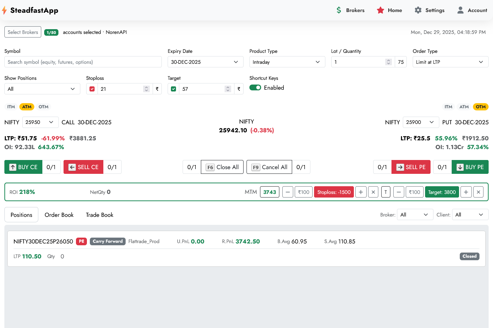
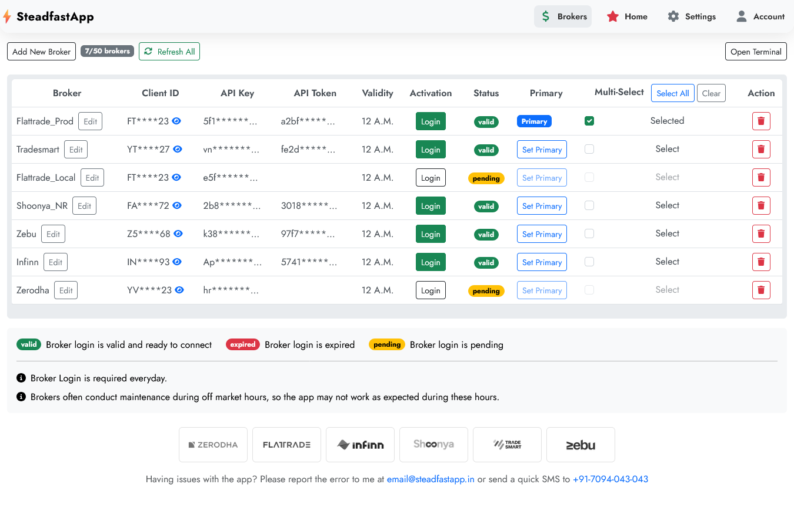
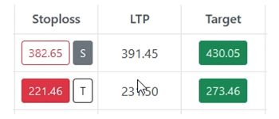
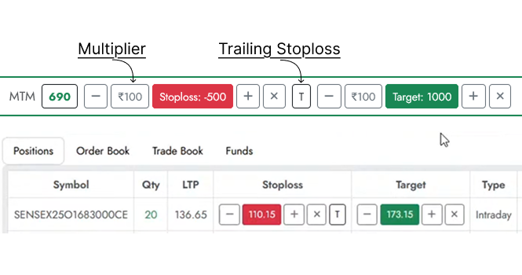

# AmpTrade 
Amptrade allows users to connect, trade, replicate/copy trades to multiple brokers simultaneously. 

### Notes
This is a monorepo containing the following services:
- amptrade-web: The website frontend
| Development | `localhost:5178` |
- amptrade-api: The backend API
| Development | `localhost:3089` |
- amptrade-websocket: The websocket service for real-time data
| Development | `localhost:8789 to localhost:8795` |

### Screenshots

- AmpTrade Desktop Preview

- Manage Brokers

- Quick SL/Target Controls

- Risk Management

- Scroll-To-Trade

